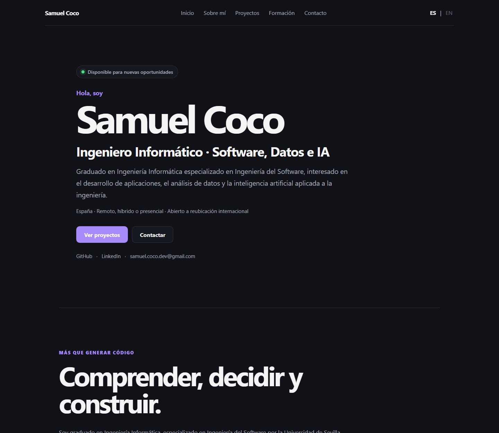

# Samuel Coco — Personal Portfolio

[](https://github.com/SamuCoco04/SamuCoco04.github.io/actions/workflows/deploy.yml)


Professional, bilingual portfolio for Samuel Coco, available at
[samucoco04.github.io](https://samucoco04.github.io/). It presents my profile,
projects, Final Degree Project, education, technologies, resumes and contact
details in a single accessible page.



## Features

- Spanish and English interface with a persisted language preference.
- Responsive light and dark themes based on the system setting.
- ErasmusMate case study, three prototype iterations and public FDP report.
- Bilingual, downloadable resumes and professional contact links.
- Accessible semantics, keyboard navigation, skip link and reduced-motion support.
- Static and language-aware SEO, Open Graph, JSON-LD, sitemap and manifest.
- Unit, component, end-to-end and automated accessibility tests.
- Quality-gated deployment to GitHub Pages through GitHub Actions.

## Stack

React, TypeScript, Vite, i18next, CSS, Vitest, Testing Library, Playwright,
axe-core, Lighthouse CI, GitHub Actions and GitHub Pages.

## Project structure

```text
├── .github/workflows/   # Pull-request checks and gated Pages deployment
├── docs/                # Architecture, quality guide and preview
├── public/              # Documents, project media, SEO and app icons
├── scripts/             # Stable local preview server for automated checks
├── src/
│   ├── components/      # Shared interface components
│   ├── data/            # Professional project, skill and contact data
│   ├── hooks/           # Language-aware document metadata
│   ├── locales/         # Spanish and English translations
│   ├── sections/        # Portfolio page sections
│   └── test/            # Vitest and Testing Library tests
└── tests/e2e/           # Playwright and axe checks
```

## Local development

```bash
npm install
npm run dev
npm run build
npm run preview
```

## Quality checks

```bash
npm run typecheck
npm run lint
npm run test:run
npm run test:e2e
npm run check
npm run lighthouse
```

`npm run check` runs type checking, linting, unit/component tests and the
production build in sequence. Playwright installs Chromium separately with
`npx playwright install chromium` for a first local run.

## Technical decisions

- i18next centralises UI translations and persists the language in local storage.
- Static professional data is separated from section presentation components.
- Each substantial section owns its CSS while reusing global design tokens.
- The single-page design uses native anchors and requires no client router.
- GitHub Pages provides simple static hosting; PDFs remain versioned public assets.
- Static metadata supports crawlers while a hook synchronises metadata after a
  client-side language change.

More detail is available in [Architecture](docs/ARCHITECTURE.md) and
[Quality](docs/QUALITY.md).

## Accessibility

The site uses semantic landmarks and headings, visible keyboard focus, translated
accessible names, a skip link and reduced-motion preferences. Playwright runs
axe checks in Spanish, English and a mobile viewport, failing on serious or
critical violations.

## Deployment

Pull requests run type checking, linting, Vitest, a production build and
Playwright. Pushes to `main` deploy the validated build only after both the
quality and E2E jobs pass. No local deployment command or custom token is needed.

## Resumen en español

Portfolio profesional bilingüe de Samuel Coco con proyectos, TFG, formación,
tecnologías, CV en español e inglés y vías de contacto. Incluye SEO, accesibilidad,
pruebas automatizadas y despliegue continuo con controles de calidad.

## Author and contact

Samuel Coco Delfa · [GitHub](https://github.com/SamuCoco04) ·
[LinkedIn](https://www.linkedin.com/in/samuel-coco-delfa) ·
[samuel.coco.dev@gmail.com](mailto:samuel.coco.dev@gmail.com)

## License

All rights reserved unless otherwise stated.
